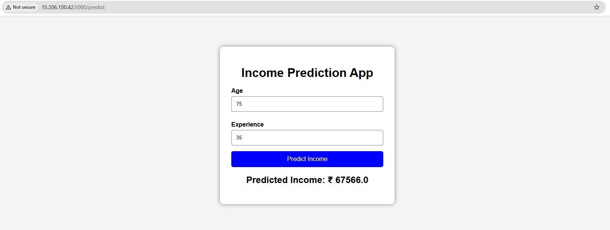

# 🚀 Flask ML Deployment on AWS

A production-ready Machine Learning API deployment using **Flask**, **Gunicorn**, **Docker**, and **Nginx** on an **AWS EC2 (Ubuntu)** instance.

---

## 📂 Project Structure

```text
.
├── app.py              # Flask API & Model Inference logic
├── model.pkl           # Trained ML Model (Binary file)
├── Dockerfile          # Container instructions
├── requirements.txt    # Python dependencies (Flask, Gunicorn, etc.)
└── README.md           # Project documentation

# 🛠️ Initial Server Setup (AWS Ubuntu)

This section details the steps to prepare a fresh AWS Ubuntu 22.04/24.04 instance for hosting a Flask/Docker application.

---

## 1. System Updates
Ensure your package lists and installed software are up to date:
```bash
sudo apt update && sudo apt upgrade -y

# 🐳 Docker Deployment Guide (Flask ML API)

This section provides the complete workflow for containerizing your Machine Learning application and managing it on an AWS Ubuntu instance.

---

## 1. Prerequisites
Ensure your project directory contains the following files:
* `app.py` (Flask Application)
* `model.pkl` (Trained Model)
* `requirements.txt` (Dependencies including `gunicorn`)
* `Dockerfile` (Build Instructions)

---

## 2. Building the Image
The build process creates a snapshot of your environment.

### Standard Build
```bash
docker build -t mymlapp:latest .

## 🛡️ AWS Security Group Configuration (GUI)

To allow traffic to your ML API, you must configure the **Inbound Rules** in the AWS Console. 

### 📸 Screenshot: Inbound Rules Setup

*Figure 1: Configuration of Port 80 (Nginx) and Port 22 (SSH) in the AWS EC2 Console.*

### 🛠️ Required Rule Settings
Ensure your "Inbound Rules" table matches the settings below:

| Type | Protocol | Port Range | Source | Description |
| :--- | :--- | :--- | :--- | :--- |
| **SSH** | TCP | 22 | `My IP` | Allows terminal access to your instance. |
| **HTTP** | TCP | 80 | `0.0.0.0/0` | Allows public access to your API via Nginx. |
| **Custom TCP** | TCP | 5000 | `0.0.0.0/0` | (Optional) For testing Docker directly. |

---

### 📝 How to capture this screenshot:
1. Log in to your **AWS Management Console**.
2. Go to **EC2 > Instances** and click on your Instance ID.
3. Click the **Security** tab and then click the link under **Security Groups**.
4. Click **Edit inbound rules**.
5. Take a screenshot of the rules table and save it as `aws_security_group.png` inside a `screenshots/` folder in your project.
